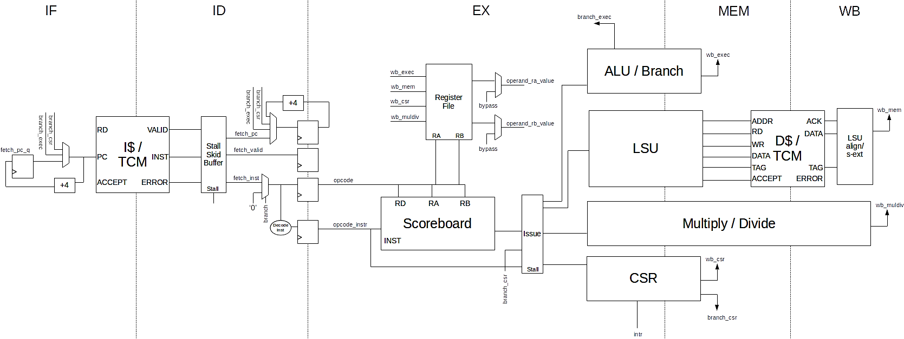
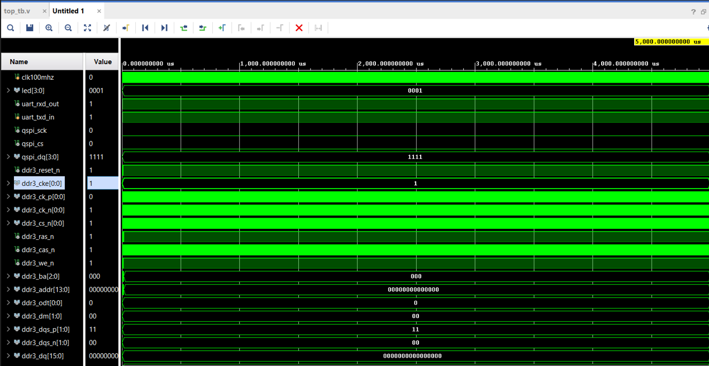
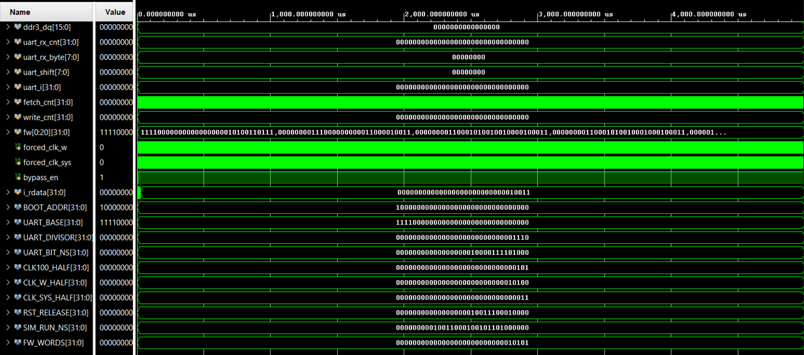
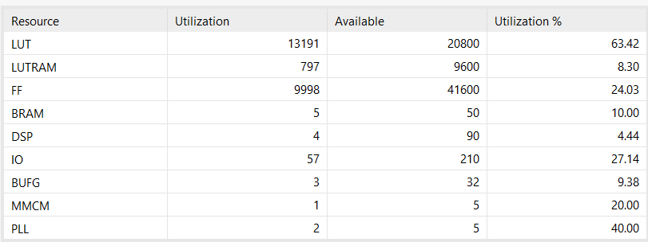
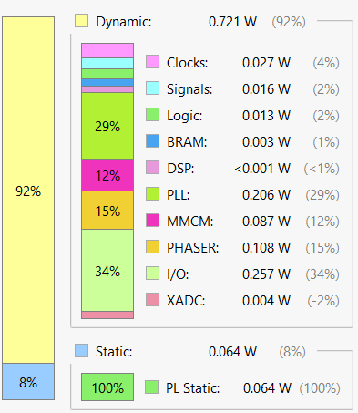
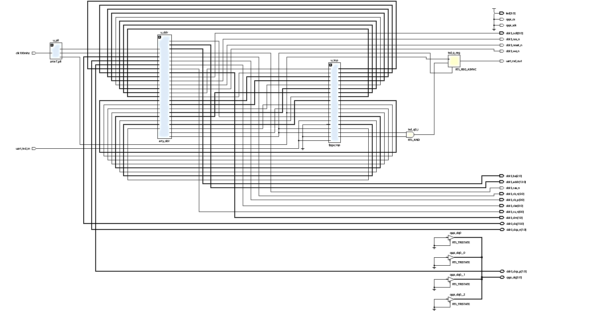

# RISC-V Multi-Gateway FPGA

A RISC-V based multi-gateway embedded SoC implemented and evaluated on a
Xilinx Artix-7 FPGA using Xilinx Vivado.


------------------------------------------------------------------------

## Overview

This project presents a RISC-V based multi-gateway embedded computer
implemented on a low-cost Digilent Arty Artix-7 FPGA board.

The design extends the openly available UltraEmbedded RV32IM core and
companion SoC/peripheral wrapper with board-level clocking, external
DDR3 memory, and AXI clock-domain-crossing infrastructure.

The project focuses on the system surrounding the RISC-V core,
including:

-   External DDR3 memory integration using Xilinx MIG
-   AXI4 and AXI4-Lite interconnect
-   AXI clock-domain crossing
-   Artix-7 PLL-based clock generation
-   UART and SPI interfaces
-   GPIO
-   Timer and interrupt controller
-   Debug bridge
-   Project-specific Verilog verification
-   Post-implementation FPGA resource and power evaluation

------------------------------------------------------------------------

## System Architecture

The platform is organized into three main functional domains:

1.  **Clock-generation domain** based on the Artix-7 PLL
2.  **Memory domain** containing the DDR3 MIG controller and AXI CDC
    buffer
3.  **Processor domain** containing the RISC-V core, AXI interconnect,
    and peripheral controllers



### Principal Hardware Blocks

  -----------------------------------------------------------------------
  Block                               Role
  ----------------------------------- -----------------------------------
  Artix-7 PLL                         Generates CPU, DDR, system, and
                                      calibration clock domains

  DDR3 MIG                            Provides the external memory path
                                      through AXI4

  AXI CDC Buffer                      Bridges processor and DDR clock
                                      domains

  RISC-V RV32IM Core                  Executes firmware and issues
                                      memory/peripheral transactions

  AXI4 / AXI4-Lite Fabric             Routes processor traffic to memory
                                      and peripherals

  UART / SPI                          Serial and synchronous peripheral
                                      interfaces

  GPIO                                General-purpose digital
                                      input/output

  Timer / Interrupt Controller        Timing reference and interrupt
                                      aggregation

  Debug Bridge                        Firmware loading and system
                                      inspection
  -----------------------------------------------------------------------

------------------------------------------------------------------------

## RISC-V Processor

The processor foundation is the UltraEmbedded RV32IM RISC-V core.

The processor contains the standard five-stage organization used by the
upstream implementation:

-   Instruction Fetch
-   Instruction Decode
-   Execute
-   Memory Access
-   Write Back



> The RV32IM processor shown above is part of the upstream UltraEmbedded
> RISC-V project. This repository does not claim ownership of the
> upstream processor implementation. The project-specific work focuses
> on the surrounding FPGA integration, memory, clocking, CDC,
> verification, and implementation evaluation.

------------------------------------------------------------------------

## Memory and Clocking

### DDR3 Memory

The external memory path is implemented using the Xilinx 7-Series Memory
Interface Generator (MIG).

The DDR3 subsystem provides:

-   DDR3 initialization and calibration
-   AXI4 memory interface
-   External memory connectivity
-   Dedicated DDR clock domain

### Clock Generation

A dedicated Artix-7 PLL stage derives the required clock domains from
the board's 100 MHz oscillator.

The clocking structure provides independent domains for:

-   CPU
-   DDR
-   System
-   Calibration

Because the processor and DDR3 controller operate in different clock
domains, an AXI clock-domain-crossing buffer is used to safely bridge
the two domains.

------------------------------------------------------------------------

## Peripheral Subsystem

The SoC peripheral fabric contains:

-   UART
-   SPI
-   GPIO
-   Timer
-   Interrupt controller
-   Debug bridge

The AXI4-Lite interface provides register-based access between the
RISC-V processor and the peripheral controllers.

------------------------------------------------------------------------

## Verification

A project-specific Verilog testbench is included in:

``` text
testbench/top_tb.v
```

The verification environment was developed as a waveform-based
system-level testbench rather than using the SystemC/Verilator flow
shipped with the upstream baseline.

The testbench exercises:

-   Clock and reset generation
-   Instruction fetch activity
-   Memory-write traffic
-   UART framing/activity
-   DDR3-side signaling
-   Processor/system-level behavior

### Simulation Result



The waveform provides evidence of processor activity, memory
transactions, UART activity, and DDR3-side signaling during a single
simulation run.

> The DDR3-side verification uses response stubs rather than a complete
> physical DDR3 timing model. Therefore, the simulation should be
> interpreted as system-level interface/functional verification rather
> than complete physical DDR3 validation.

------------------------------------------------------------------------

## FPGA Platform

  Parameter         Configuration
  ----------------- -----------------------
  Board             Digilent Arty Artix-7
  FPGA Family       Xilinx Artix-7
  Device            XC7A35T-1CSG324-1L
  HDL               Verilog HDL
  FPGA Tool         Xilinx Vivado
  Processor         RISC-V RV32IM
  External Memory   DDR3
  Interconnect      AXI4 / AXI4-Lite

------------------------------------------------------------------------

## FPGA Implementation Flow

The design was taken through the following FPGA development flow:

``` text
RTL Design
    |
    v
Functional Simulation
    |
    v
Synthesis
    |
    v
Placement
    |
    v
Routing
    |
    v
Resource Analysis
    |
    v
Power Analysis
```

The implementation targets the Xilinx Artix-7 XC7A35T-1CSG324-1L device
using Xilinx Vivado.

------------------------------------------------------------------------

## Post-Implementation Results

### Resource Utilization

  Resource         Used   Utilization
  ------------ -------- -------------
  LUTs           13,191        63.42%
  Flip-Flops      9,998        24.03%
  Block RAM           5        10.00%
  DSP48               4         4.44%
  BUFG                3           ---
  MMCM                1           ---
  PLL                 2           ---



The larger LUT count reflects the complete platform rather than the
processor core alone. The implementation includes the RISC-V processor,
DDR3/MIG infrastructure, AXI fabric, clocking, CDC logic, peripherals,
and debug infrastructure.

BRAM and DSP utilization remain comparatively low, leaving potential
resources for future hardware accelerators and additional buffering.

------------------------------------------------------------------------

## Power Analysis

The reported post-implementation on-chip power is:

**0.786 W**



The power figure is a Vivado post-implementation estimate and should not
be interpreted as a board-level measured power value.

The reported thermal margin is:

**71.2 °C**

------------------------------------------------------------------------

## Synthesized Design

The synthesized design hierarchy illustrates the integration of the
RISC-V processor, memory infrastructure, AXI interconnect, peripheral
subsystem, and FPGA-specific logic.



------------------------------------------------------------------------

## Project Structure

``` text
RISC-V-MultiGateway-FPGA/
│
├── constraints/
│   └── arty_revb.xdc
│
├── fpga/
│   └── arty/
│       ├── artix7_pll.v
│       ├── arty_ddr.v
│       ├── axi4_cdc.v
│       ├── dbg_bridge.v
│       ├── dbg_bridge_fifo.v
│       ├── dbg_bridge_uart.v
│       ├── fpga_top.v
│       └── top.v
│
├── images/
│   ├── architecture.png
│   ├── power_analysis.png
│   ├── resource_utilization.png
│   ├── rv32im_pipeline.png
│   ├── simulation_waveform.png
│   └── synthesized_netlist.png
│
├── ip/
│   ├── axi_cdc_buffer/
│   │   └── axi_cdc_buffer.xci
│   └── mig_axis/
│       └── mig_axis.xci
│
├── testbench/
│   └── top_tb.v
│
├── upstream/
│   └── riscv_soc/
│
├── vivado/
│   └── block_design/
│       └── design_1.bd
│
├── .gitignore
├── .gitmodules
└── README.md
```

------------------------------------------------------------------------

## Repository Contents

### `constraints/`

Contains the FPGA pin and timing constraints for the target Arty-7
platform.

### `fpga/`

Contains project-specific FPGA RTL for:

-   Artix-7 clock generation
-   DDR interface integration
-   AXI CDC
-   Debug infrastructure
-   FPGA top-level integration

### `ip/`

Contains the Xilinx Vivado IP configuration files:

``` text
ip/
├── axi_cdc_buffer/
│   └── axi_cdc_buffer.xci
└── mig_axis/
    └── mig_axis.xci
```

Generated IP build artifacts are intentionally excluded from version
control.

### `testbench/`

Contains the project-level Verilog testbench.

### `vivado/`

Contains the Vivado block-design source.

### `upstream/`

Contains the upstream RISC-V SoC as a Git submodule.

Keeping the upstream project as a submodule makes the boundary between
upstream source and project-specific integration explicit.

------------------------------------------------------------------------

## Upstream Project and Attribution

This project builds upon the open-source UltraEmbedded RISC-V processor
and `riscv_soc` platform.

The upstream SoC is included as a Git submodule under:

``` text
upstream/riscv_soc/
```

The upstream source, copyright notices, and license information remain
associated with the original project.

This repository does **not** claim ownership of the original
UltraEmbedded RISC-V processor or SoC implementation.

The project-specific focus is on:

-   FPGA integration
-   External DDR3 memory integration
-   Artix-7 clocking
-   AXI clock-domain crossing
-   Project-specific verification
-   FPGA synthesis and implementation
-   Resource and power evaluation

------------------------------------------------------------------------

## What This Project Demonstrates

### Computer Architecture

-   RISC-V ISA
-   RV32IM processor architecture
-   CPU/SoC integration
-   Memory subsystem integration
-   Peripheral architecture

### FPGA Design

-   Verilog HDL
-   Xilinx Artix-7
-   Digilent Arty-7
-   FPGA synthesis
-   Placement and routing
-   Resource utilization analysis
-   Power estimation
-   Timing constraints

### Interconnect

-   AXI4
-   AXI4-Lite
-   Clock-domain crossing
-   AXI clock conversion
-   Peripheral register interfaces

### Embedded Interfaces

-   UART
-   SPI
-   GPIO
-   Timer
-   Interrupt controller
-   Debug interface

### Memory

-   DDR3
-   Xilinx MIG
-   AXI-based memory access

### Verification

-   Verilog testbench
-   System-level simulation
-   Processor execution verification
-   Peripheral verification
-   Memory-interface connectivity verification

------------------------------------------------------------------------

## Reproducibility

### Requirements

-   Xilinx Vivado
-   Compatible Vivado version supporting the target Artix-7 device and
    included IP
-   Verilog simulation support
-   Digilent Arty-7 board for hardware deployment

### Clone the Repository

``` bash
git clone https://github.com/BarathKumarMS/RISC-V-MultiGateway-FPGA.git
cd RISC-V-MultiGateway-FPGA
```

Initialize the upstream submodule:

``` bash
git submodule update --init --recursive
```

The repository uses a Git submodule so that the upstream RISC-V SoC
source remains separately identifiable.

------------------------------------------------------------------------

## Vivado Flow

The general implementation flow is:

``` text
1. Clone repository
        |
        v
2. Initialize Git submodules
        |
        v
3. Open / recreate Vivado project
        |
        v
4. Add RTL and Xilinx IP
        |
        v
5. Apply Arty-7 constraints
        |
        v
6. Run simulation
        |
        v
7. Run synthesis
        |
        v
8. Run implementation
        |
        v
9. Review timing/resource reports
        |
        v
10. Generate FPGA programming output
```

Generated Vivado directories and build artifacts are intentionally
excluded from version control.

------------------------------------------------------------------------

## Limitations

The reported evaluation should be considered an implementation and
feasibility baseline rather than a complete hardware qualification.

### DDR3 Verification

The DDR3-side simulation uses response stubs rather than a complete
physical DDR3 timing model.

Therefore, the current evaluation does not establish:

-   Sustained high-throughput DDR3 operation
-   Worst-case DDR3 timing behavior
-   Long-duration DDR3 stress performance
-   Full memory calibration behavior under all operating conditions

### Power

The reported `0.786 W` is a Vivado post-implementation estimate and is
not a bench-measured board-level power value.

### Peripheral Stress Testing

The current verification does not constitute a complete concurrent
stress test of all peripheral and memory paths under maximum sustained
system load.

### Hardware Qualification

Extended hardware-in-the-loop testing and long-duration soak testing
remain future work.

------------------------------------------------------------------------

## Future Scope

Potential extensions include:

### Communication Interfaces

-   Ethernet
-   CAN
-   USB
-   Wi-Fi
-   Bluetooth

### Hardware Acceleration

-   DSP accelerators
-   Cryptographic accelerators
-   Signal-processing accelerators
-   Lightweight AI inference accelerators

### Processor Architecture

-   Multi-core RISC-V
-   Alternative RISC-V cores
-   Minimal operating-system support
-   More advanced memory subsystems

### Verification

-   Hardware-in-the-loop DDR3 testing
-   Sustained memory traffic testing
-   Board-level power measurement
-   Long-duration soak testing
-   Concurrent peripheral stress testing

------------------------------------------------------------------------

## Technologies

### Hardware

-   Digilent Arty-7
-   Xilinx Artix-7
-   DDR3

### HDL

-   Verilog HDL

### FPGA Tools

-   Xilinx Vivado
-   Xilinx MIG
-   Xilinx AXI IP

### Processor

-   RISC-V
-   RV32IM

### Interfaces

-   AXI4
-   AXI4-Lite
-   UART
-   SPI
-   GPIO
-   DDR3

### Version Control

-   Git
-   GitHub
-   Git Submodules

------------------------------------------------------------------------

## Project Status

``` text
RTL Design              ✓
System Integration      ✓
Simulation              ✓
Synthesis               ✓
Implementation           ✓
Resource Analysis       ✓
Power Estimation        ✓
Documentation           ✓
Hardware Stress Testing Planned
```

------------------------------------------------------------------------

## Author

**Barath Kumar M**

M.E. VLSI Design and Embedded Systems\
Anna University -- MIT Campus

GitHub:

https://github.com/BarathKumarMS

------------------------------------------------------------------------

## Disclaimer

This repository contains project-specific FPGA integration,
verification, configuration, and documentation built around an
open-source RISC-V SoC platform.

The original RISC-V processor and upstream SoC components remain subject
to their respective upstream licenses and copyrights.

Please refer to the upstream repository and its license before
redistributing or modifying upstream components.
